# Automated PaaS Installer on VHI/VHC

This project helps you create PaaS (Virtuozzo Application Platform or VAP) on top of the [Virtuozzo Hybrid Infrastructure](https://www.virtuozzo.com/hybrid-infrastructure/) or [Virtuozzo Hybrid Cloud](https://www.virtuozzo.com/hybrid-cloud/) (VHI/VHC) cluster.

- **[Prerequisites](#installation-prerequisites)** – ensure that you meet all the installation requirements
- **[Prepare Infrastructure](#infrastructure-configuration)** – configure your VHI/VHC cluster via UI or CLI
- **[PaaS Web Installer](#paas-web-installer)** – run the automatic PaaS installer
- **[Removing VAP Stack](#remove-vap-stack)** – delete unnecessary VAP stacks


## Installation Prerequisites

Before starting the installation, make the following preparations:

1\. Get **VHI/VHC cluster** account and obtain a **Virtuozzo Application Platform license**. ([send a request](https://forms.office.com/e/4F667yc4j3)).

2\. Upload the latest **VAP qcow2 template** to your cluster via admin UI or CLI. We recommend the latter option as it is faster:

- Login to your physical VHI cluster primary node via SSH.
- Download the latest *VAP qcow2* template from the [repository](https://vap-images.virtuozzo.dev/vap-images/latest/). For example, with the following command:
```
wget https://vap-images.virtuozzo.dev/vap-images/latest/vap-8-4-3.qcow2
```
- Create an image:
```
vinfra service compute image create vap-8-4-3 --disk-format qcow2 --container-format bare --file vap-8-4-3.qcow2 --public --wait
```

3\. Check [PaaS requirements](https://www.virtuozzo.com/application-platform-ops-docs/hardware-requirements-local-storage/) and, if needed, [create flavors](https://docs.virtuozzo.com/virtuozzo_hybrid_infrastructure_5_4_admins_guide/index.html#creating-custom-flavors.html) with sufficient resources in your VHI cluster.

4\. Ensure the cluster has a **publicly accessible** physical network:

- 1 IP for each VM
- 2 IPs for resolvers
- additional IP range if you want to use public IP for user environments

5\. Open the following ports on the VHI node before installing the "VAP installer" container: *5000, 8004, 8774, 8776, 9292, and 9696*.

> **Tip:** You can close access to these ports after successful installation.

## Infrastructure Configuration

We’ve prepared **GUI** and **CLI** installation scenarios for automatic VHI cluster configuration. The GUI flow just provides the visual interface to help perform installation and configuration without manual commands. Otherwise, both flows are similar and utilize the same set of the commands. Deployment does not require in-depth knowledge of the Virtuozzo Application Platform or [VHI Openstack](https://github.com/virtuozzo/vhideploy).

### GUI Installation

1\. Log in or register at any [Virtuozzo Application Platform](https://www.virtuozzo.com/application-platform-partners/). Click the Import button at the top of the dashboard.


2\. Paste the following link in the opened window:

```
https://github.com/virtuozzo/vap-installer-on-vhi/blob/master/manifest.yml
```

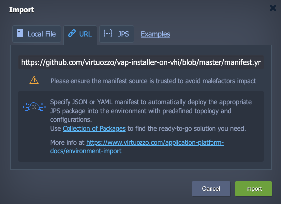

Click **Import** to proceed.

3\. Provide any preferred *Environment* domain and *Display Name*.

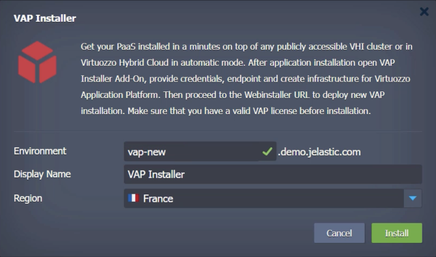

Click **Install** and wait a few minutes for the platform to automatically create an environment to set up your VHI/VHC infrastructure.

4\. Once installed, hover over the Python application server and click **Add-Ons**. Within the corresponding panel, you can see the *VAP Installer Add-On* that will perform all the needed actions.

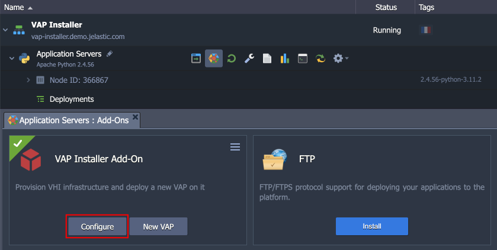

5\. Before proceeding, you need to **Configure** the add-on:

- ***Project Domain Name*** – name of the VHI project domain where all the VMs for the new PaaS will be created
- ***User Domain Name*** – name of the VHI user domain where all the VMs for the new PaaS will be created
- ***Project Name*** – name of the VHI project where all the VMs for the new PaaS will be created
- ***Username*** – VHI account user to create VMs
- ***Password*** – VHI account password to create VMs
- ***URL*** – VHI cluster API endpoint
- ***VAP Project Domain*** – name for your VAP project domain
- ***New SSH Key***
  - *enable* (recommended) - to automatically generate SSH key pair (public key will be uploaded to VHI cluster and private stored within the environment) for accessing your VMs
  - *disable* – to manually manage SSH keys for your VMs
- ***New SSH Key Name*** – name for the automatically generated public key uploaded to VHI cluster (only if **New SSH Key** is enabled)

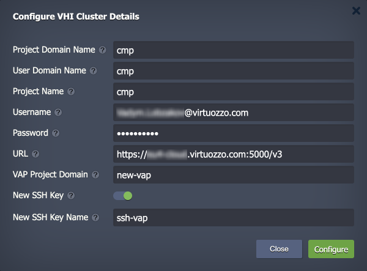

Click **Configure** to confirm.

6\. Next, click the **New VAP** button within the add-on and provide the following data:

- ***SSH Key Name*** – public SSH key from the VHI cluster (automatically preselected if a new one was generated in the previous step)
- ***Installation Type*** – four installation types (*PoC*, *Sandbox*, *Production*, *High Performance Production*) are available
- ***RAM&CPU Infra*** – VM flavor for the *Infra* host
- ***RAM&CPU User*** – VM flavor for the *User* host

> **Note:** Ensure that selected flavors meet the requirements shown within the corresponding hints (automatically adjusted based on the preselected installation type).
>
> 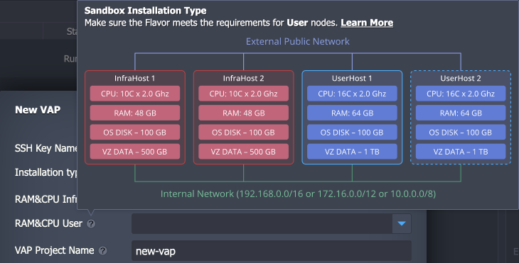

- ***VAP Project Name*** – name of the required VAP project (same as specified in the previous step by default)
- ***Infra Storage, GB*** – storage volume size for the '**/**' and '**/vz**' partitions and for **swap** on Infra nodes
- ***User Storage, GB*** - storage volume size for the '**/**' and '**/vz**' partitions and for **swap** on User node(s)
- ***User Node Count*** – number of User hosts to be created within the platform
- ***VHI Public Subnet*** – cluster's public subnet to attach created instances
- ***VAP Image Name*** – a *qcow2* image with the PaaS version

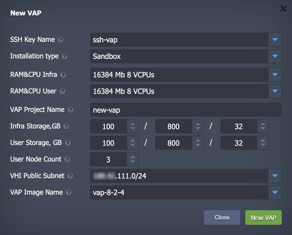

> **Note:** If you get an error, ensure the add-on is configured correctly (see the previous step).

7\. Click **New VAP** and confirm the creation via popup. You’ll see a notification with a link to the PaaS installer (also stored in the ***/var/log/installer.log*** file) in several minutes.

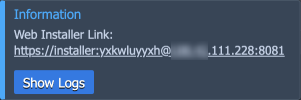

Follow the URL to access the PaaS web installer.

### CLI Installation

The CLI version of the guide may be needed in some specific cases. For example, if the public access for the API endpoint of the cluster is not configured. In such a case the commands can be executed manually from the VHI cluster controller node.

> **Note:** The ***openstackclient*** and ***heatclient*** software are required to work with the installer. Both should be pre-installed on VHI cluster. Otherwise, use the `pip install python-openstackclient` and `pip install python-heatclient` commands.

1\. Clone the installer repository from GitHub.

```
git clone https://github.com/virtuozzo/vap-installer-on-vhi
```

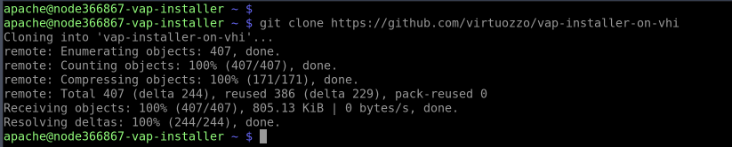

2\. Go to the **~/vap-installer-on-vhi/installer/** directory and run the `vap.sh` script for information on the script usage and parameters.

```
cd vap-installer-on-vhi/installer/
sh vap.sh
```

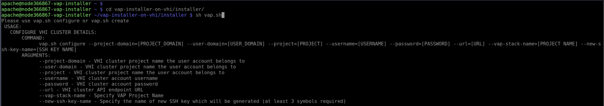

3\. Configure your stack by running the `vap.sh configure` command with the following parameters:

- ***project-domain*** – VHI cluster project domain name where all the VMs for the new PaaS will be created
- ***user-domain*** – VHI cluster user domain name where all the VMs for the new PaaS will be created
- ***project*** – VHI cluster project name where all the VMs for the new PaaS will be created
- ***username*** – VHI account user to create VMs
- ***password*** – VHI account password to create VMs
- ***url*** – VHI cluster API endpoint URL
- ***vap-stack-name*** - name for your VAP project domain
- ***new-ssh-key-name*** – name for the public SSH key; if specified, a new key pair will be automatically generated and public key uploaded to VHI cluster (optional)

```
sh vap.sh configure --project-domain={domain} --user-domain={domain} --project={project} --username={name} --password={password} --url={url} --vap-stack-name={stack} --new-ssh-key-name={SSH key name}
```

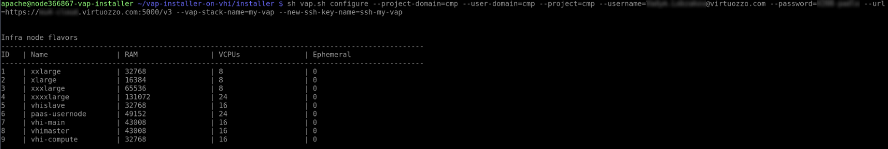

4\. Create the required infrastructure with the `vap.sh create` command. Use the tables from the previous step response to choose the appropriate parameters (according to the [PaaS requirements](https://www.virtuozzo.com/application-platform-ops-docs/hardware-requirements-local-storage/)):

- ***infra-flavor*** – infra node flavor (size)

> **For example:** Check the corresponding table from the previous step and select the **ID** of the appropriate flavor. Use the same approach for the *user-flavor*, *subnet*, and *image* parameters below.
>
> 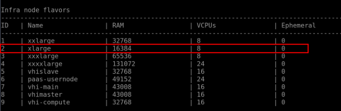

- ***user-flavor*** – user node flavor (size)
- ***subnet*** – VHI cluster's public subnet
- ***image*** – an image with the PaaS version
- ***user-host-count*** – number of user hosts to create for the PaaS cluster
- ***infra-root-size*** – storage volume size (GB) for the '**/**' partition on Infra nodes
- ***infra-vz-size*** – storage volume size (GB) for the '**/vz**' partition on Infra nodes
- ***user-root-size*** – storage volume size (GB) for the '**/**' partition on User node(s)
- ***user-vz-size*** – storage volume size (GB) for the '**/vz**' partition on User node(s)
- ***infra-swap-size*** – Infra node swap size (GB)
- ***user-swap-size*** – User node swap size (GB)
- ***key-name*** - public SSH key from the VHI cluster

```
sh vap.sh create --infra-flavor={ID} --user-flavor={ID} --subnet={ID} --image={ID} --user-host-count={number} --infra-root-size={GB} --infra-vz-size={GB} --user-root-size={GB} --user-vz-size={GB} --infra-swap-size={GB} --user-swap-size={GB} --key-name={SSH key name}
```

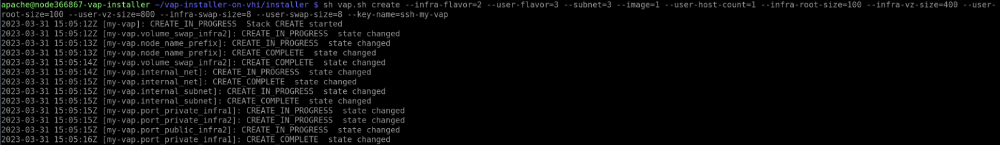

5\. Once completed, you’ll see a web installer link for your PaaS (also stored in the ***/var/log/installer.log*** file).

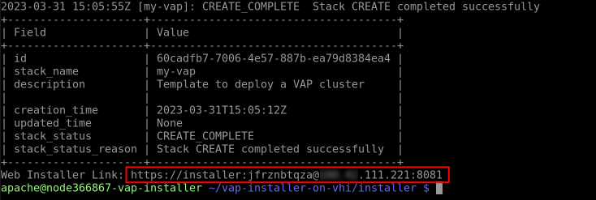

Open the URL and complete the installation via web installer.


## PaaS Web Installer

Web installer for Virtuozzo Application Platform automates all the operations required to get the PaaS. You just need to provide the following data before the star:

- ***System User Email*** – specify the email for the platform admin user
- ***License Key*** – provide a license key for the business edition of the PaaS (obtained from the Support Team) via the [form](https://forms.office.com/e/4F667yc4j3))
- ***Platform Entry Point IP*** – automatically obtained from the previously provided data (not editable)
- ***Domain*** – specify the preferred domain name for the platform; use the **Custom Domain** toggle to:
  - *disabled* – provide a third-level domain name for the default DNS zone with an automatic delegation
  - *enabled* – specify your custom domain (requires [manual delegation](https://www.virtuozzo.com/application-platform-ops-docs/dns-zones-delegation/) to the platform entry point IP, it will be verified before starting the installation)
- ***Install Monitoring*** – enable if you want to configure default integration with the Zabbix monitoring system (disable to configure monitoring manually)

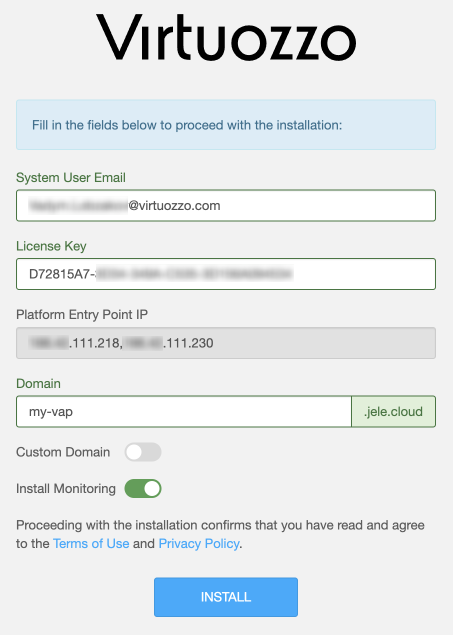

Click **Install** to start the installation. Be patient, as the process can take up to 10-20 minutes, depending on your hardware.

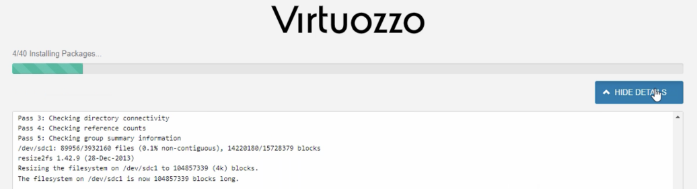

Once ready, you’ll see the admin user credentials and links to the **Ops** (admin panel) and **Dev** (user dashboard) panels.

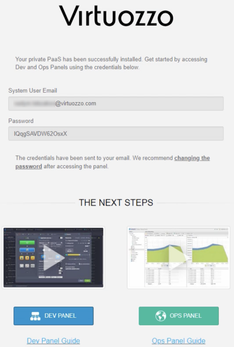

That’s all! The platform is ready for [post-installation configurations](https://www.virtuozzo.com/application-platform-ops-docs/onboarding-guide/).


## Remove VAP Stack

If you decide to remove your VAP project from the VHI cluster, you can use the [OpenStack CLI](https://docs.virtuozzo.com/virtuozzo_hybrid_infrastructure_5_4_admins_guide/index.html#connecting-to-openstack-command-line-interface.html?Highlight=openstack) functionality.

1\. Create or edit the OpenStack source file based on the provided example:

- **OS_PROJECT_DOMAIN_NAME** - the name of the domain to deploy the stack
- **OS_USER_DOMAIN_NAME** - the name of the user domain
- **OS_PROJECT_NAME** - the name of the project to deploy the stack
- **OS_USERNAME** - user name
- **OS_PASSWORD** - user password
- **OS_AUTH_URL** - the URL of the OpenStack endpoint, it must be published and available

```
vim project.sh
```

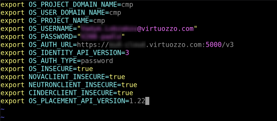

2\. Load the source file:

```
source project.sh
```


3\. Get the stack list:

```
openstack stack list
```

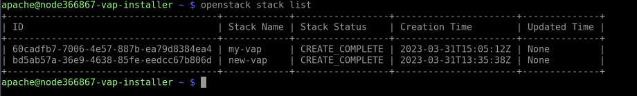

4\. Remove the required stack:

```
openstack stack delete {name}
```

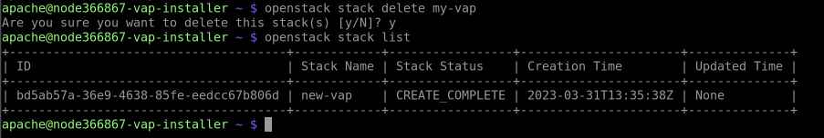
